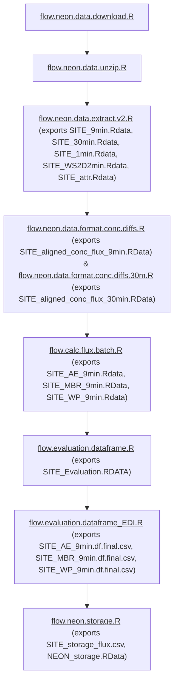

# LTER Synthesis working group -- The Flux Gradient Project: Understanding the methane sink-source capacity of natural ecosystems


## PIs: 

- Sparkle L. Malone, Assistant Professor, Yale University
- Jackie H. Matthes, Senior Scientist, Harvard University

## Project Summary

- https://lternet.edu/working-groups/the-flux-gradient-project/

## Repository Structure

```
lterwg-flux-gradient/
├── functions/               # Core analysis functions
│   ├── calc.*.R             # Calculation functions
│   ├── flag.*.R             # Quality control functions
│   ├── plot.*.R             # Visualization functions
│   └── compile.*.R          # Data processing functions
│
├── workflows/               # Complete analysis workflows
│   ├── flow.neon.data.*.R   # Data acquisition workflows
│   ├── flow.calc.*.R        # Flux calculation workflows
│   └── flow.*.R             # Analysis workflows
│
├── exploratory/             # Preliminary analyses and development
│   └── ...
│
└── deprecated/              # Unused workflows and functions
```

## Data Frame Organization
- Column name should use snake case include units, last "_" proceeds units (i.e. var_molperm3)
- no "- or /" in column names

## Getting Started

1. Clone this repository
   ```bash
   git clone https://github.com/lter/lterwg-flux-gradient.git
   cd lterwg-flux-gradient
   ```

2. Install required R packages
   ```r
   # Core packages
   install.packages(c("tidyverse", "neonUtilities", "rhdf5", "googledrive", 
                     "foreach", "doParallel", "lubridate", "ggplot2"))
   
   # Additional packages
   install.packages(c("gslnls", "terra", "sf", "ggh4x"))
   
   # If using BiocManager
   if (!requireNamespace("BiocManager", quietly = TRUE))
       install.packages("BiocManager")
   BiocManager::install("rhdf5")
   ```

## Main Flux Workflow

The script `Workflow_master.R` will run the files below in the order required to produce the file needed for the repository: https://github.com/lter/lterwg-flux-gradient-eval



### Data Acquisition and Extraction

1. `flow.neon.data.download.R`: Workflow script that downloads NEON HDF5 (eddy covariance files) files for all sites and time periods of interest. ALSO downloads all required MET data products that are not in the bundled HDF5 file. 

2. `flow.neon.data.unzip.R`: Unzips all downloaded NEON data files.

3. `flow.neon.data.extract.v2.R`: Extracts and stacks downloaded and unzipped data into R objects for each data averaging interval, saved in their own RData file. These are currently `SITE_9min.Rdata` (9-min/6-min concentrations), `SITE_30min.Rdata` (30-min met and flux data), `SITE_1min.Rdata` (1-min met data), and `SITE_WS2D2min.Rdata` (2D wind speed data), where `SITE` is the NEON site code. Also extracts and saves site attributes from the HDF5 files into `SITE_attr.Rdata`. Zips and optionally uploads to Google Drive.

### Concentration Processing

4. `flow.neon.data.format.conc.diffs.R` & `flow.neon.data.format.conc.diffs.30m.R`: Align the 9-min or 30-min concentration data among adjacent tower levels (and also the bottom-top levels). `flow.neon.data.format.conc.diffs.R` interpolates 30-min eddy flux and MET data to the 9-min/6-min concentrations, including but not limited to u*, ubar (profile), roughness length. `flow.neon.data.format.conc.diffs.30m.R` connects the nearest 9-min/6-min data to each 30-min eddy covariance measurement. Also derives kinematic water flux (LE -> w'q'), heat flux (w'T'), aerodynamic canopy height, displacement height, that are needed for the various methods. Differences the concentrations for CH4, CO2, and H2O for adjacent tower levels (and bottom-top). Saves output as `SITE_aligned_conc_flux_9min.RData` and `SITE_aligned_conc_flux_30min.RData`. Zips and optionally uploads to Google Drive.

Note: if you need to download the output from `flow.neon.data.format.conc.diffs.R` and `flow.neon.data.format.conc.diffs.30m.R` off Google Drive, you can run `flow.download.aligned.conc.flux.R`. 

### Flux Calculation

5. `flow.calc.flux.batch.R`: Loads aligned concentration & flux data locally and calculates the fluxes using MBR (`flow.calc.flag.mbr.batch.R`), AE (`flow.calc.flag.aero.batch.R`), and WP (`flow.calc.flag.windprof.batch.R`) methods and adds quality flag columns, month, hour, residual, rmse for calculated fluxes. Saves output as `SITE_AE_9min.Rdata`, `SITE_MBR_9min.RData`, and `SITE_WP_9min.Rdata`. Zips and optionally uploads to Google Drive, except `SITE_AE_9min.zip` was not able to export to Google Drive so `SITE_AE_9min.Rdata` was exported instead.

6. `flow.evaluation.dataframe.R`: Loads flux calculations locally and standardizes the data format from the MBR, AE, and WP. Develops the validation dataframes needed to perform the evaluation. Saves output as `SITE_Evaluation.RDATA`. Optionally uploads to Google Drive.
   
7. `flow.evaluation.dataframe_EDI.R`: Formats the validation data for EDI publication. Saves output as `SITE_AE_9min.df.final.csv`, `SITE_MBR_9min.df.final.csv`, and `SITE_WP_9min.df.final.csv`.

8. `flow.neon.storage.R`: Calculates storage fluxes. Saves output as `SITE_storage_flux.csv`. All the combined storage fluxes are also saved as `NEON_storage.RData`.

## Other Workflows

### Non-NEON Processing
`flow.non.neon.attribute.tables.R`: Creates attribute tables for non-NEON sites that are consistent with those of NEON sites. Uploads to Google Drive as `SITE_attr.RData` and `SITE_attr.zip` where `SITE` is the non-NEON site.

`flow.non.neon.data.harmonize.ch4.R`: Harmonizes methane data from non-NEON sites. Uploads to Google Drive as `methane_non-neon_harmonized.csv`.

`flow.SE-Sto.data.format.conc.diffs.R`: Merges together flux, met, and profile concentration data for site SE-Sto. Aligns the profile concentration data (CH4, CO2, and H2O) among adjacent tower levels (and also the bottom-top levels) and computes the difference in mean concentration. Aligns non-concentration data with the mid-point of the paired-level concentration differences. Uploads to Google Drive as `SE-Sto_attr.zip and SE-Sto_aligned_conc_flux_9min.zip`.

`flow.SE-Svb.data.format.conc.diffs.R`: Merges together flux, met, and profile concentration data for site SE-Svb. Aligns the profile concentration data (CH4, CO2, and H2O) among adjacent tower levels (and also the bottom-top levels) and computes the difference in mean concentration. Aligns non-concentration data with the mid-point of the paired-level concentration differences. Uploads to Google Drive as `SE-Svb_attr.zip and SE-Svb_aligned_conc_flux_9min.zip`.

`flow.US-Uaf.data.format.conc.diffs.R`: Merges together flux, met, and profile concentration data for site US-Uaf. Aligns the profile concentration data (CH4, CO2, and H2O) among adjacent tower levels (and also the bottom-top levels) and computes the difference in mean concentration. Aligns non-concentration data with the mid-point of the paired-level concentration differences. Uploads to Google Drive as `US-Uaf_attr.zip and US-Uaf_aligned_conc_flux_9min.zip`.

### Misc

`flow.eval.fluxes.MBR.bootstrap.R`: Computes diel averages after filtering the MBR fluxes for tracer concentrations that are close to zero.

`flow.eval.plots.R`: Creates linear 1 to 1 plots across all sites and bar plots of variable across all sites. Also plots light response curves for daytime CO2 vs daytime PAR for FG and EC calculated fluxes, and temperature response curves for nighttime CO2 vs nighttime air temperature for FG and EC calculated fluxes. Plots diurnal averages for all sites.

`flow.flag.flux.stats.R`: Runs quality flag functions and calculates residuals. Uploads to Google Drive as `SITES_WP_val.Rdata`, `SITES_AE_val.Rdata`, and `SITES_MBR_val.zip`. 

`flow.icos.data.1sec.summarize.R`: Aggregates ICOS high frequency data.

## Function Folder
- Use hierarchical naming with the active verb first, i.e. "flag.iqr.R"
- This is where all functions called by flow. scripts in Workflow Folder are stored

## Exploratory Folder
- Wild West, this is where preliminary functions and workflows are stored

## Deprecated Folder
- This is where unused workflows and functions are stored

## NEON Data Products
- Relative humidity: https://data.neonscience.org/data-products/DP1.00098.001
- 2D wind speed and direction: https://data.neonscience.org/data-products/DP1.00001.001
- Photosynthetically active radiation (PAR): https://data.neonscience.org/data-products/DP1.00024.001
- Bundled data products - eddy covariance: https://data.neonscience.org/data-products/DP4.00200.001

## Related Repositories

- [lterwg-flux-gradient-eval](https://github.com/lter/lterwg-flux-gradient-eval): Code for the evaluation paper
- [lterwg-flux-gradient-methane](https://github.com/lter/lterwg-flux-gradient-methane): Code for the methane paper

## Supplementary Resources

LTER Scientific Computing Team [website](https://lter.github.io/scicomp/) & NCEAS' [Resources for Working Groups](https://www.nceas.ucsb.edu/working-group-resources)
